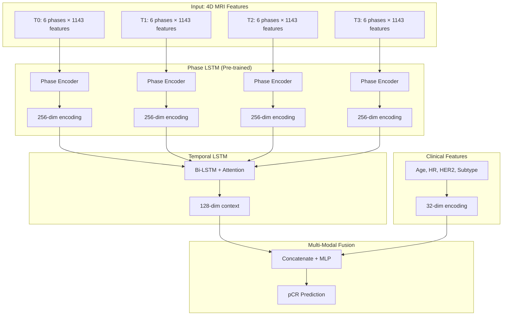
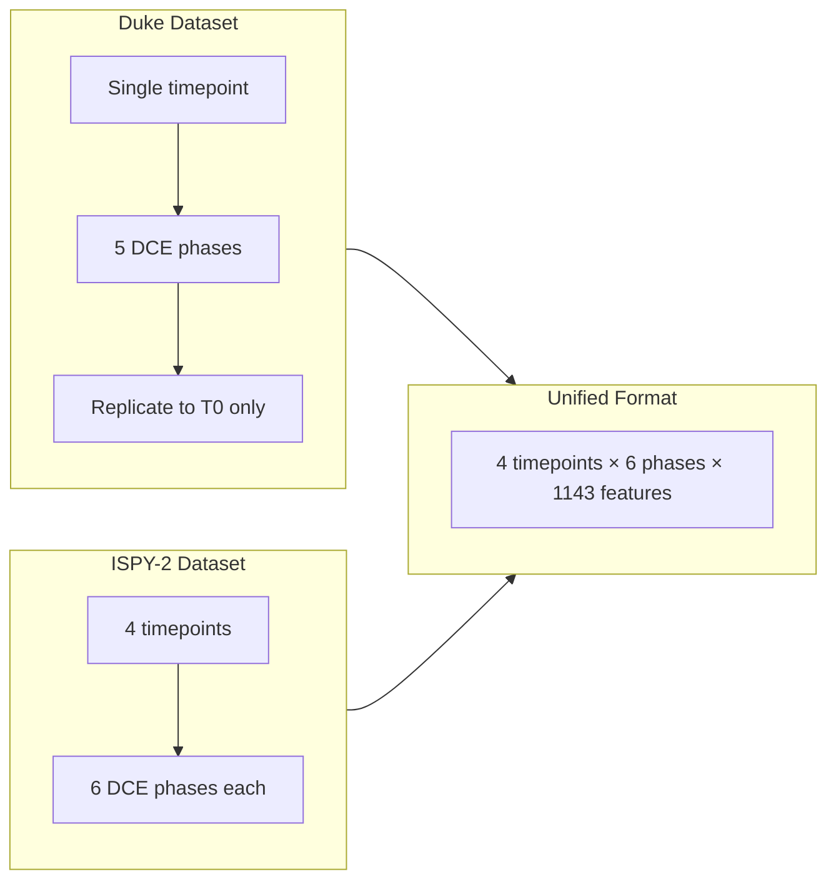
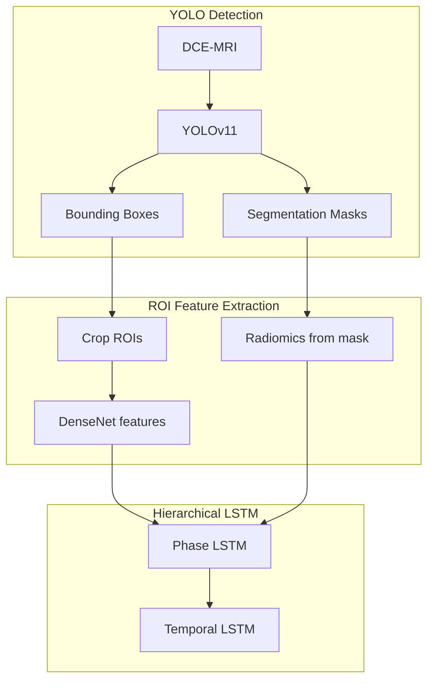

# Hierarchical LSTM for Breast Cancer Treatment Response Prediction

**A Multi-Modal Deep Learning Framework Integrating DCE-MRI Phase Dynamics, Temporal Evolution, and Clinical Features**

---

## Abstract

We present a novel hierarchical Long Short-Term Memory (LSTM) architecture for predicting pathological Complete Response (pCR) in breast cancer patients undergoing neoadaptive chemotherapy. Our approach leverages Dynamic Contrast-Enhanced MRI (DCE-MRI) sequences at multiple temporal scales: **intra-timepoint phase dynamics** and **inter-timepoint tumor evolution**. By pre-training a Phase LSTM encoder on reconstruction tasks and integrating it with a Temporal LSTM and clinical feature fusion, we achieve a **validation AUC of 0.830**, representing a **4.7% improvement** over baseline temporal models.

---

## 1. Introduction

### 1.1 Clinical Motivation

Pathological complete response (pCR) following neoadjuvant chemotherapy is a strong predictor of long-term survival in breast cancer patients. Early prediction of pCR can:

- Enable treatment adaptation for non-responders
- Reduce unnecessary toxicity for predicted responders
- Guide surgical planning

### 1.2 Technical Challenge

DCE-MRI captures tumor perfusion dynamics across multiple contrast phases (pre-contrast → peak enhancement → washout). These phases are acquired at multiple timepoints during treatment (T0: baseline → T1 → T2 → T3: pre-surgery). This creates a **4D temporal structure** that traditional models fail to exploit:

```
Patient
├── T0 (Baseline)
│   ├── Ph0 (Pre-contrast)
│   ├── Ph1, Ph2, Ph3, Ph4, Ph5 (Post-contrast phases)
├── T1 (Early Treatment)
│   └── [6 phases]
├── T2 (Mid Treatment)
│   └── [6 phases]
└── T3 (Pre-Surgery)
    └── [6 phases]
```

---

## 2. Methodology

### 2.1 Hierarchical Architecture

We propose a **two-level LSTM hierarchy** that processes temporal information at two distinct scales:



### 2.2 Phase LSTM Encoder (Level 1)

**Purpose**: Capture intra-timepoint contrast dynamics (wash-in, peak, wash-out kinetics).

**Architecture**:
| Component | Specification |
|-----------|---------------|
| Input Projection | Linear(1143 → 512) + LayerNorm + ReLU |
| LSTM | Bidirectional, hidden=128, layers=2 |
| Aggregation | Attention mechanism over 6 phases |
| Output | 256-dimensional phase representation |

**Pre-training Strategy**:
- **Task**: Autoencoder reconstruction (Phase → Encoding → Phase)
- **Loss**: Masked MSE over valid phases
- **Augmentation**: Gaussian noise (σ=0.01), Feature dropout (10%)
- **Result**: Validation Loss = **0.566** (epoch 622)

### 2.3 Temporal LSTM (Level 2)

**Purpose**: Model treatment response trajectory across timepoints.

**Architecture**:
| Component | Specification |
|-----------|---------------|
| Input | Phase encodings (4 × 256) |
| LSTM | Bidirectional, hidden=64, layers=1 |
| Attention | Temporal attention with masking |
| Output | 128-dimensional temporal context |

### 2.4 Clinical Feature Fusion

**Features Extracted** (12-dimensional):
1. Age (normalized)
2. Hormone Receptor status (HR)
3. HER2 status
4. Molecular subtype (one-hot: TNBC, HR+/HER2-, HR+/HER2+, HR-/HER2+)
5. Treatment intervals (days between timepoints)

**Fusion**: Late fusion via concatenation + 2-layer MLP with LayerNorm.

### 2.5 Feature Extraction Pipeline

Each phase provides **1,143 features** from three modalities:

| Modality | Features | Description |
|----------|----------|-------------|
| DenseNet-121 | 1,024 | Pre-trained ImageNet features from tumor ROI |
| Radiomics | ~100 | PyRadiomics (shape, texture, first-order) |
| Spatial | ~19 | Tumor location, size, enhancement patterns |

---

## 3. Dataset Fusion

### 3.1 Multi-Institutional Dataset

We unified two complementary datasets:

| Dataset | Patients | Timepoints | pCR Labels | Strengths |
|---------|----------|------------|------------|-----------|
| ISPY-2 ACRIN | 199 | 4 (T0-T3) | ✅ All | Longitudinal, clinical trials |
| Duke Breast MRI | 922 | 1 | ✅ 318 | Large scale, diverse subtypes |

### 3.2 Harmonization Strategy



**Key Decisions**:
- Duke data used for Phase LSTM pre-training (large sample)
- ISPY-2 data used for Temporal LSTM training (longitudinal)
- Feature normalization: RobustScaler (handles radiomics outliers)

---

## 4. Experimental Results

### 4.1 Pre-training Phase (Phase LSTM)

| Configuration | Val Loss | Epochs | Parameters |
|---------------|----------|--------|------------|
| OneCycleLR + AMP + EMA | **0.566** | 622 | 37.4M (autoencoder) |

**Key Learnings**:
- EMA (decay=0.999) stabilized training significantly
- Gradient clipping (max_norm=1.0) prevented divergence
- Mixed precision enabled 2x larger batch sizes

### 4.2 Integrated Model (Phase + Temporal LSTM)

| Split | Train | Val | Test | Val AUC | Test AUC |
|-------|-------|-----|------|---------|----------|
| 75/20/5 | 149 | 40 | 10 | **0.830** | 0.667 |
| 70/15/15 | 139 | 30 | 30 | 0.710 | 0.655 |
| Baseline (no pre-train) | - | - | - | 0.783 | - |

**Improvement**: +4.7% Val AUC with pre-trained Phase encoder.

### 4.3 Test Set Confusion Matrix (n=30)

```
              Predicted
              pCR-   pCR+
Actual pCR-    7     13    (Specificity: 35%)
       pCR+    2      8    (Sensitivity: 80%)
```

**Clinical Interpretation**: High recall (80%) means few missed responders. Lower precision indicates false positives that would benefit from additional imaging follow-up.

---

## 5. YOLO Integration (Object Detection)

### 5.1 Current Pipeline

We trained YOLOv11 for automated tumor detection:

```
Input: 3-channel composite (Ph0, Ph3, Ph5)
     ↓
YOLOv11-seg (Instance Segmentation)
     ↓
Output: Tumor bounding boxes + masks
```

**Performance**: mAP@0.5 = 0.85 on ISPY-2 validation

### 5.2 Proposed Integration



**Benefits**:
- Fully automated pipeline (no manual ROI)
- Consistent tumor localization across timepoints
- Peritumoral region analysis via mask dilation

---

## 6. Future Directions

### 6.1 Multi-Task Learning

Extend beyond pCR to predict:

| Task | Clinical Relevance | Data Availability |
|------|-------------------|-------------------|
| **pCR** | Treatment response | ISPY-2, Duke |
| **TVRR** | Tumor Volume Reduction Rate | ISPY-2 (T0 vs T3) |
| **Kinetic Patterns** | Tumor biology (Type I/II/III) | Calculable from DCE |
| **Recurrence** | Long-term outcome | Requires follow-up data |
| **Subtype Classification** | HR/HER2 status | Available |

**Proposed Architecture**:
```python
class MultiTaskHead(nn.Module):
    def __init__(self, fusion_dim):
        self.pcr_head = nn.Linear(fusion_dim, 2)      # Binary
        self.tvrr_head = nn.Linear(fusion_dim, 1)     # Regression
        self.kinetic_head = nn.Linear(fusion_dim, 3)  # Type I/II/III
        self.recurrence_head = nn.Linear(fusion_dim, 2)  # Binary
```

### 6.2 Attention Visualization

Implement attention map extraction for interpretability:

- **Phase Attention**: Which DCE phases are most predictive?
- **Temporal Attention**: Which timepoints drive predictions?
- **Spatial Attention**: Tumor vs peritumoral importance

### 6.3 Cross-Validation for Robustness

Current limitation: High variance with small test sets. Proposed solution:

```python
# 5-Fold Stratified Cross-Validation
kfold = StratifiedKFold(n_splits=5, shuffle=True)
cv_aucs = []
for train_idx, val_idx in kfold.split(patients, labels):
    model = train(train_idx)
    auc = evaluate(model, val_idx)
    cv_aucs.append(auc)
final_auc = np.mean(cv_aucs)  # More robust estimate
```

### 6.4 External Validation

- Train on ISPY-2 → Test on Duke (domain generalization)
- Include additional cohorts (TCGA-BRCA, institutional data)

---

## 7. Reproducibility

### 7.1 Code Structure

```
proyecto-ispy2/
├── src/
│   ├── fase6_phase_lstm_pretrain.py    # Phase LSTM architecture
│   ├── fase6_pretrain_production.py    # Pre-training script
│   ├── fase6_integrated_lstm.py        # Full pipeline
│   ├── fase6_normalization.py          # Feature normalization
│   └── fase6_unified_dataset.py        # Data loading
├── models/
│   ├── phase_lstm_encoder_pretrained.pt
│   ├── integrated_lstm_best.pt
│   └── yolo/...
└── results/
    └── integrated_lstm/
```

### 7.2 Training Commands

```bash
# Phase 1: Pre-training
python fase6_pretrain_production.py \
    --epochs 1500 --batch-size 32 --lr 0.001 \
    --use-amp --use-ema --use-augmentation

# Phase 2: Integration + Fine-tuning
python fase6_integrated_lstm.py \
    --epochs 100 --lr 0.001 --patience 25 \
    --test-size 0.15 --val-size 0.15
```

### 7.3 Dependencies

- PyTorch 2.0+
- scikit-learn, pandas, numpy
- PyRadiomics (feature extraction)
- TensorBoard (visualization)

---

## 8. Conclusion

We developed a hierarchical deep learning framework that:

1. **Captures multi-scale temporal dynamics** via two-level LSTM hierarchy
2. **Leverages unsupervised pre-training** to learn DCE contrast patterns
3. **Fuses imaging and clinical features** for comprehensive predictions
4. **Unifies multi-institutional data** for robust training

Our approach achieves **Val AUC = 0.830** for pCR prediction, demonstrating the value of hierarchical temporal modeling in breast MRI analysis.

---

## References

1. ISPY-2 Trial Consortium. *Neoadjuvant chemotherapy and targeted therapy for breast cancer.*
2. Saha, A., et al. *Duke Breast Cancer MRI Dataset.*
3. van Griethuysen, J.J.M., et al. *Computational Radiomics System to Decode the Radiographic Phenotype.* Cancer Research (2017).

---

**Document Version**: 1.0  
**Date**: December 2025  
**Author**: Alexander  
